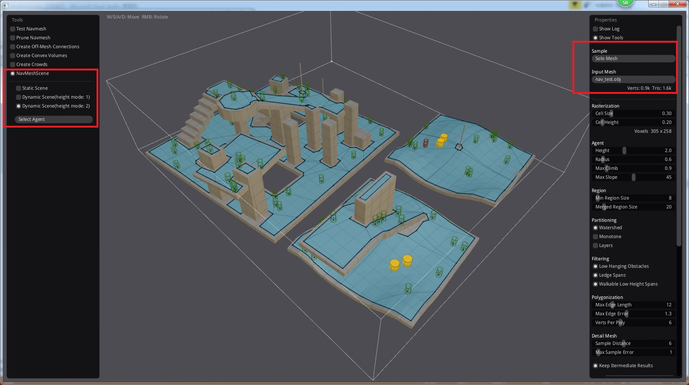

# NavMeshScene

## 功能

  - 使用recastnavigation构建3D场景，支持Solo Mesh、Tile Mesh、Temp Obstacles
  - 提供游戏对象地面行走
  - 提供游戏对象间碰撞，及事件通知
  - 提供游戏对象与场景碰撞，及事件通知
  - 支持改变地形

## build

**window**

```dos
git submodule update --init -- "aoi"
cd build
g.bat
```

打开 NavMeshScene.sln

**linux**

```bash
git submodule update --init -- "aoi"
cd build
g.sh
make config=release_x64
```

## 例子

[example2](example2)



  - 红色圆柱为受玩家控制的游戏对象
  - 绿色圆柱为AI游戏对象
  - 黄色圆柱为`动态障碍物`，可以改变地形


## TODO:

  - 完善AOI系统，内置观察者列表，让移动效率更高效。
