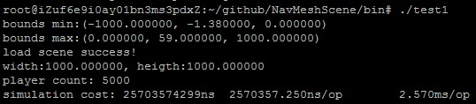

# NavMeshScene

## 功能

  - 使用recastnavigation构建3D场景，支持Solo Mesh、Tile Mesh、Temp Obstacles
  - 提供游戏对象地面行走
  - 提供游戏对象间碰撞，及事件通知
  - 提供游戏对象与场景碰撞，及事件通知
  - 支持改变地形

## build

**window**

```dos
git submodule update --init -- "aoi"
cd build
g.bat
```

打开 NavMeshScene.sln

**linux**

```bash
git submodule update --init -- "aoi"
cd build
g.sh
make config=release_x64
```

## 目前性能



相关内容   | 说明
--------- | -----------------------------------
测试例子   | [tests/test1](tests/test1/main.cpp)
场景大小   | 1000 * 1000
游戏对象数 | 5000
AOI半径    | 0.6
一次op     | 所有游戏对象都做一次移动

**测试机器配置**

阿里云ECS服务器，配置： 1 vCPU 2 GB (I/O优化) ecs.t5-lc1m2.small 1Mbps

## 例子

[example2](example2)


  - 红色圆柱为受玩家控制的游戏对象
  - 绿色圆柱为AI游戏对象
  - 黄色圆柱为`动态障碍物`，可以改变地形


## 地图资源说明

NavMeshScene 加载的地图资源使用 exampe2 工具导出的。

exampe2 在 recastnavigation 工具基础上，对文件头做对齐处理；增加了地图bounds等信息这些操作。

同时，也支持 recastnavigation 原工具导出的资源格式。

## DOTO

- 基于`offMeshLink`增加`跳跃`的功能与例子
- 新增新的随机地图位置算法，原随机算法对于Tile类型大地图太慢

